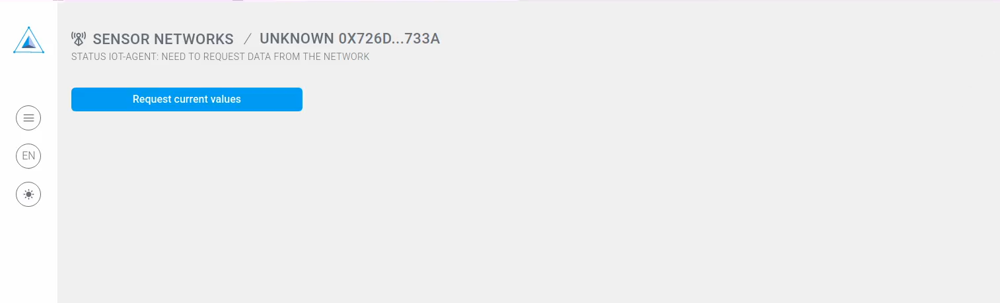

# Getting Started

Web3 Framework for smart cities and industry 4.0 app developers

The idea of the network is to connect a particular service and a Dapp user interface. The following chart describes what place Robonmics takes in the scenario.

Try it out yourself [here](#sensor-demo)!

## What the documentation contains

### I'm interested in using Robonomics services

Take a look at the [Robonomics Dapp](https://dapp.robonomics.network/#/). Get familiar with the statistic, average miner reward etc.
Try out existing [services](https://dapp.robonomics.network/#/services)

### I'm a Dapp developer

There are [Robonomics-js]() library and [dapp template](https://github.com/airalab/vue-dapp-robonomics-template)

### I'm a robotics engineer

Links:

* Install AIRA
* Messages
* FAQ
* etc...

## Sensor Demo

Let's start from a quick example of what Robonomics is able to do within 5 minutes.

> Requirements: [Metamask extension](https://metamask.io/)

Open <a href="https://dapp.robonomics.network/#/sensors/airalab/QmWjvXGfVUDBNR15BBH5ERGP3SzEKbeLZWx7Fcp4kwwaw9/0x726d6066b075F663311166bff9cd5f44aEbc733A/" target="_blank">sensor demo</a> website and follow instructions below

### 1. Open the Dapp

You see the next picture in case you don't have MetaMask extension. Go to the link provided above and install one

### 2. Allow connection to the extension

### 3. Press "Request current values"

### 4. Sign a message. No token or ether are needed

### 5. Wait until the agent collects the data and sends it back

### 6. Wait until the Dapp downloads the result file from IPFS

### 7. Look at the data

Just now you have broadcasted a demand message and got a result from an autonomous agent! The result file is stored in IPFS, the result message is signed with the agent's private key.

